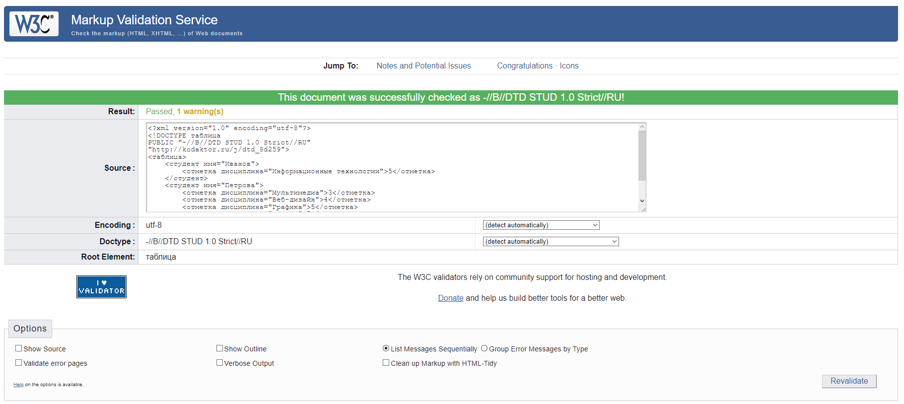

## Языковые средства веб-технологий на основе XML и CSS и развёртывание среды разработки компонентов аппаратно-программных комплексов

1. Представьте свои текущие знания в области HTML в виде набора тегов (правильно сформированного XML-документа)

2. Осуществите рефакторинг DTD для данного документа, уменьшив количество повторяющихся инструкций

```xml
<?xml version="1.0" encoding="utf-8"?>
<!DOCTYPE таблица
PUBLIC "-//B//DTD COMPETENCY 1.0 Strict//RU"
"http://kodaktor.ru/j/dtd_f4681">
<myportfolio>
    <competencies>
        <competency field="HTML" value="middle"/>
        <compenency field="CSS" value="middle"/>
        <competency field="JS" value="middle"/>
        <compenency field="PHP" value="good"/>
        <compenency field="SSL" value="worse"/>
    </competencies>
</myportfolio>
```

```dtd
<?xml version="1.0" encoding="utf-8"?>
<!ELEMENT myportfilio (competencies)>
<!ELEMENT competencies (competency)*>
<!ATTLIST competency
    field CDATA #REQUIRED
    value CDATA #REQUIRED
>
```

3. Рассмотрите документ Статистика посещений страницы (https://kodaktor.ru/g/08092017_stats). Основываясь на нём, разработайте язык для описания посещений некоторого URL, т.е. создайте DTD и валидный документ

```xml
<?xml version="1.0" encoding="utf-8"?>
<!DOCTYPE stats
PUBLIC "-//B//DTD STATS 1.0 Strict//RU"
"https://kodaktor.ru/j/_dtd/7c00a">
<stats>
    <popular ip="077.234.203.101"/>
    <platforms>
        <desktop>
            <platform type="Windows" count="87"/>
            <platform type="Linux" count="8"/>
            <platform type="MacOS" count="6"/>
        </desktop>
        <mobile>
            <platform type="Android" count="10"/>
            <platform type="iPhone" count="5"/>
        </mobile>
    </platforms>
    <ips>
        <ip addr="077.234.203.101" frequency="12"/>
        <ip addr="005.144.096.251" frequency="11"/>
        <ip addr="081.222.086.058" frequency="6"/>
        <ip addr="005.164.066.173" frequency="4"/>
        <ip addr="094.019.018.060" frequency="4"/>
    </ips>
</stats>
```

```dtd
<?xml version="1.0" encoding="UTF-8"?>

<!ELEMENT stats (popular,platforms,ips)>
<!ATTLIST stats
  xmlns CDATA #FIXED ''>

<!ELEMENT popular EMPTY>
<!ATTLIST popular
  xmlns CDATA #FIXED ''
  ip CDATA #REQUIRED>

<!ELEMENT platforms (desktop,mobile)>
<!ATTLIST platforms
  xmlns CDATA #FIXED ''>

<!ELEMENT ips (ip)+>
<!ATTLIST ips
  xmlns CDATA #FIXED ''>

<!ELEMENT desktop (platform)+>
<!ATTLIST desktop
  xmlns CDATA #FIXED ''>

<!ELEMENT mobile (platform)+>
<!ATTLIST mobile
  xmlns CDATA #FIXED ''>

<!ELEMENT ip EMPTY>
<!ATTLIST ip
  xmlns CDATA #FIXED ''
  addr CDATA #REQUIRED
  frequency CDATA #REQUIRED>

<!ELEMENT platform EMPTY>
<!ATTLIST platform
  xmlns CDATA #FIXED ''
  count CDATA #REQUIRED
  type CDATA #REQUIRED>
```

4. Разработайте или сгенерируйте схему (XML Schema) для документа и осуществите её валидацию с помощью инструмента типа [xmlvalidation.com](https://xmlvalidation.com)

```xml
<?xml version="1.0" encoding="utf-8"?>
<!DOCTYPE таблица
PUBLIC "-//B//DTD STUD 1.0 Strict//RU"
"http://kodaktor.ru/j/dtd_8d259">
<таблица>
    <студент имя="Иванов">
        <отметка дисциплина="Информационные технологии">5</отметка>
    </студент>
    <студент имя="Петрова">
        <отметка дисциплина="Мультимедиа">3</отметка>
        <отметка дисциплина="Веб-дизайн">4</отметка>
        <отметка дисциплина="Графика">5</отметка>
        <отметка дисциплина="Логика">5</отметка>
    </студент>
</таблица>
```

```dtd
<?xml version="1.0" encoding="utf-8"?>
<!ELEMENT таблица (студент)*>
<!ELEMENT студент (отметка)*>
<!ATTLIST студент
  имя CDATA #REQUIRED
>
<!ELEMENT отметка (#PCDATA)>
<!ATTLIST отметка
  дисциплина CDATA #REQUIRED
>
```

Валидация документа:

